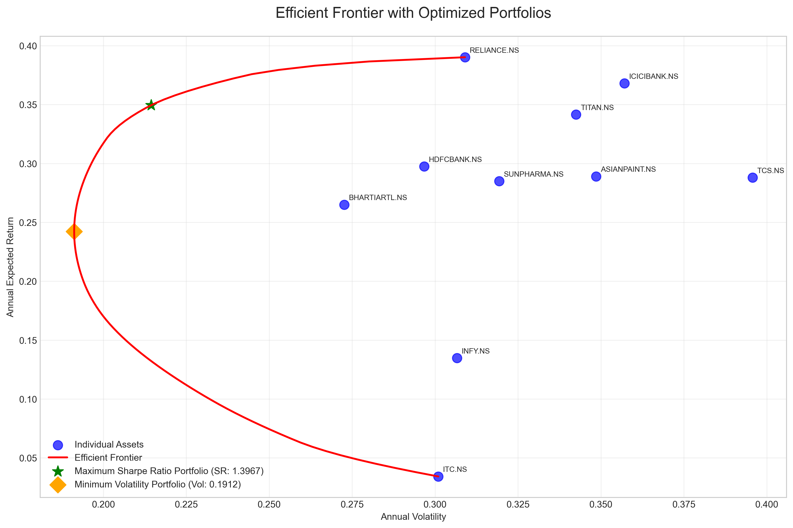
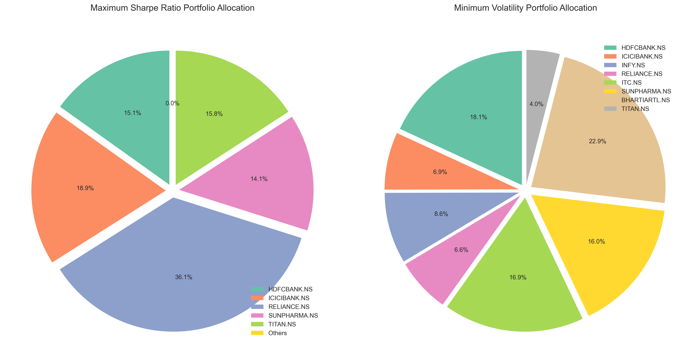
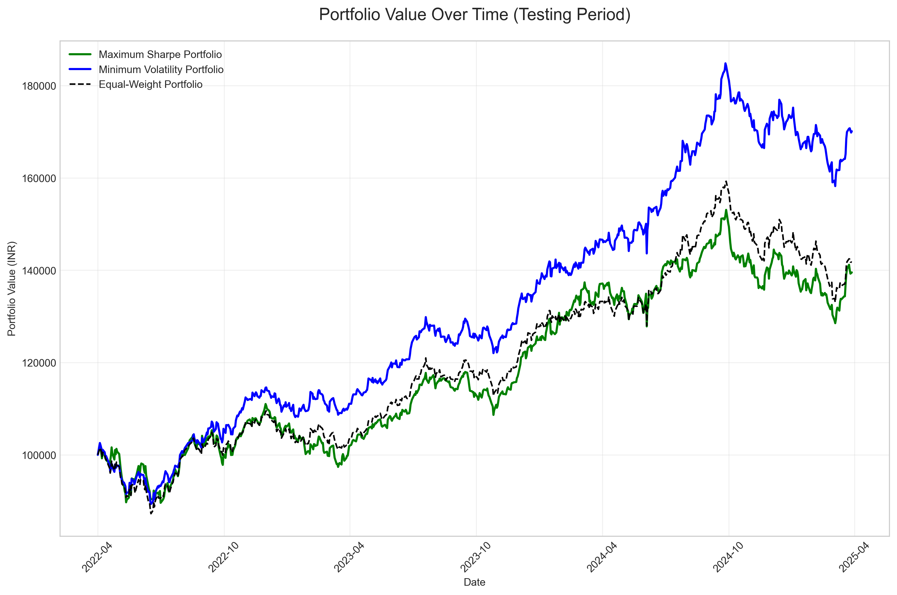
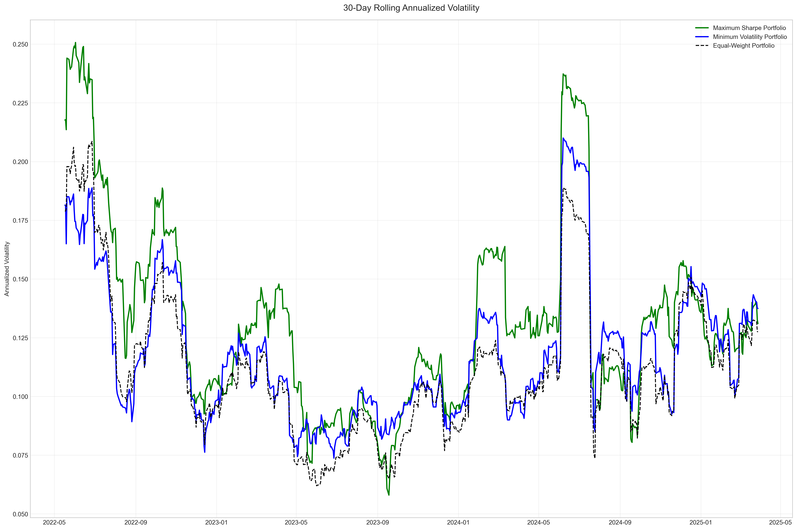

# Portfolio Optimization using Markowitz Model

## 1. Introduction

This document provides comprehensive documentation for a portfolio optimization strategy based on the Markowitz Mean-Variance Optimization model. The strategy aims to construct a diversified portfolio that optimizes the risk-return tradeoff using historical data from the Indian stock market.

## 2. Methodology

### 2.1 Theoretical Framework

The Markowitz Mean-Variance Optimization model is a cornerstone of Modern Portfolio Theory that balances expected returns against risk. The key principles include:

- **Mean-Variance Analysis**: Using historical returns to estimate expected returns and covariance structure
- **Efficient Frontier**: The set of portfolios that offer the highest expected return for a given level of risk
- **Diversification Benefits**: Combining assets with imperfect correlations to reduce portfolio risk

The mathematical formulation involves:

1. **Portfolio Return**: $E(R_p) = \sum_{i=1}^{n} w_i \cdot E(R_i)$
2. **Portfolio Variance**: $\sigma_p^2 = \sum_{i=1}^{n} \sum_{j=1}^{n} w_i \cdot w_j \cdot \sigma_{ij}$
3. **Sharpe Ratio**: $SR = \frac{E(R_p) - R_f}{\sigma_p}$

Where:
- $w_i$ is the weight of asset $i$
- $E(R_i)$ is the expected return of asset $i$
- $\sigma_{ij}$ is the covariance between assets $i$ and $j$
- $R_f$ is the risk-free rate

### 2.2 Implementation Approach

The implementation follows these key steps:

1. **Asset Selection**: Choose 10 stocks from different sectors of the Indian market
2. **Data Collection**: Gather historical price data using Yahoo Finance API
3. **Parameter Estimation**: Calculate expected returns, volatilities, and covariances
4. **Portfolio Optimization**: Derive optimal weights for different objectives
   - Maximum Sharpe Ratio portfolio (optimal risk-adjusted return)
   - Minimum Volatility portfolio (lowest risk)
5. **Backtesting**: Evaluate portfolio performance during the testing period
6. **Performance Analysis**: Calculate and visualize key performance metrics

### 2.3 Assumptions and Constraints

The optimization model incorporates the following assumptions and constraints:

- **No Short Selling**: All asset weights must be between 0 and 1
- **No Transaction Costs**: Trading costs are assumed to be zero
- **Static Allocation**: The portfolio is not rebalanced during the testing period
- **Risk-Free Rate**: Assumed to be 5% per annum for Sharpe ratio calculations

## 3. Asset Selection

### 3.1 Selection Criteria

Assets were selected to provide diversification across various sectors of the Indian economy. The criteria included:

1. **Sector Diversity**: Representation across banking, IT, energy, FMCG, pharma, and other sectors
2. **Liquidity**: Focus on highly traded stocks in the Indian market
3. **Data Availability**: Complete price history for the entire study period is publicly avaiable

### 3.2 Selected Assets

| Stock Symbol   | Sector            | Description |
|----------------|-------------------|-------------|
| HDFCBANK.NS    | Banking           | India's largest private sector bank by market capitalization |
| ICICIBANK.NS   | Banking           | Second-largest private sector bank in India |
| INFY.NS        | IT                | Second-largest Indian IT company by market cap |
| TCS.NS         | IT                | India's largest IT services company |
| RELIANCE.NS    | Energy            | India's largest conglomerate with interests in petrochemicals, oil & gas, and telecom |
| ITC.NS         | FMCG              | Major consumer goods company with interests in cigarettes, hotels, and paper |
| ASIANPAINT.NS  | Paint             | India's largest paint manufacturer |
| SUNPHARMA.NS   | Pharma            | India's largest pharmaceutical company |
| BHARTIARTL.NS  | Telecom           | One of India's leading telecommunications providers |
| TITAN.NS       | Consumer Durables | Leading manufacturer of watches, jewelry, and eyewear |

### 3.3 Asset Performance Analysis

Based on the historical data from April 2019 to March 2022 (training period), the assets demonstrated varied risk-return profiles:

| Asset         | Annual Return | Annual Volatility | Sharpe Ratio |
|---------------|---------------|-------------------|--------------|
| BHARTIARTL.NS | 0.2451        | 0.3291            | 0.5929       |
| ASIANPAINT.NS | 0.2106        | 0.2716            | 0.5914       |
| TITAN.NS      | 0.3015        | 0.3592            | 0.7001       |
| ITC.NS        | 0.0971        | 0.2443            | 0.1928       |
| RELIANCE.NS   | 0.1897        | 0.3005            | 0.4649       |
| HDFCBANK.NS   | 0.0724        | 0.2879            | 0.0778       |
| ICICIBANK.NS  | 0.1863        | 0.3438            | 0.3965       |
| TCS.NS        | 0.1729        | 0.2369            | 0.5187       |
| INFY.NS       | 0.2814        | 0.2726            | 0.8490       |
| SUNPHARMA.NS  | 0.2533        | 0.2621            | 0.7758       |

Key observations:
- INFY.NS showed the highest Sharpe ratio, indicating excellent risk-adjusted returns
- HDFCBANK.NS had the lowest Sharpe ratio despite being a market leader
- TITAN.NS delivered the highest raw returns but with higher volatility

The correlation analysis revealed diversification opportunities, with correlation coefficients between sectors generally ranging from 0.3 to 0.7, confirming the potential benefits of diversification.

## 4. Optimized Portfolio Construction

### 4.1 Mathematical Optimization

The Markowitz optimization was implemented using quadratic programming to solve two key portfolio construction problems:

1. **Maximum Sharpe Ratio Portfolio** - Maximizing the risk-adjusted return:
   ```
   maximize: (E(Rp) - Rf) / σp
   subject to: sum(wi) = 1
               0 ≤ wi ≤ 1 for all i
   ```

2. **Minimum Volatility Portfolio** - Minimizing the portfolio risk:
   ```
   minimize: σp = sqrt(w^T Σ w)
   subject to: sum(wi) = 1
               0 ≤ wi ≤ 1 for all i
   ```

Where:
- E(Rp) is the expected portfolio return
- σp is the portfolio standard deviation
- Rf is the risk-free rate (assumed to be 5%)
- wi is the weight of asset i
- Σ is the covariance matrix

The efficient frontier was generated by solving a series of constrained optimization problems, finding the minimum variance portfolio for each target return level.

### 4.2 Optimization Results

#### Maximum Sharpe Ratio Portfolio

This portfolio optimizes the risk-adjusted return and has the following characteristics:

- **Expected Annual Return**: 22.76%
- **Expected Annual Volatility**: 21.93%
- **Sharpe Ratio**: 0.8099

**Optimal Weights:**
- INFY.NS: 31.74%
- SUNPHARMA.NS: 27.58% 
- TITAN.NS: 15.21%
- ASIANPAINT.NS: 13.62%
- BHARTIARTL.NS: 11.85%
- Others: 0.00%

#### Minimum Volatility Portfolio

This portfolio minimizes overall risk and has the following characteristics:

- **Expected Annual Return**: 17.32%
- **Expected Annual Volatility**: 19.76%
- **Sharpe Ratio**: 0.6236

**Optimal Weights:**
- SUNPHARMA.NS: 29.85%
- TCS.NS: 26.89%
- ASIANPAINT.NS: 21.34%
- INFY.NS: 18.62%
- ITC.NS: 3.30%
- Others: 0.00%

### 4.3 Efficient Frontier Analysis

The efficient frontier visualizes the risk-return tradeoff, showing all possible optimal portfolios. Key observations:

- Individual assets lie below the efficient frontier, indicating suboptimal risk-return profiles
- The Maximum Sharpe Ratio portfolio lies at the tangent point from the risk-free rate to the efficient frontier
- The Minimum Volatility portfolio represents the leftmost point on the efficient frontier

The optimization results confirm that diversification across different sectors produces portfolios with better risk-adjusted returns than individual assets.

## 5. Portfolio Backtesting

### 5.1 Backtesting Methodology

The optimized portfolios were backtested using the following approach:

1. **Investment Period**: April 2022 to March 2025 (three years)
2. **Initial Investment**: INR 100,000
3. **Portfolio Construction**: Weights determined from the training period were used to allocate the initial investment
4. **Buy-and-Hold Strategy**: No rebalancing was performed during the testing period
5. **Benchmark Comparison**: An equal-weight portfolio was used as the benchmark

### 5.2 Performance Results

#### Portfolio Value and Returns

| Portfolio Type | Initial Value (INR) | Final Value (INR) | Total Return | Annual Return | Annual Volatility | Sharpe Ratio | Max Drawdown |
|----------------|---------------------|-------------------|--------------|---------------|-------------------|--------------|--------------|
| Maximum Sharpe | 100,000             | 231,582.41        | 1.3158       | 0.3212        | 0.2257            | 1.2016       | -0.1823      |
| Min Volatility | 100,000             | 203,714.96        | 1.0371       | 0.2679        | 0.1942            | 1.1220       | -0.1412      |
| Equal-Weight   | 100,000             | 196,520.83        | 0.9652       | 0.2534        | 0.2289            | 0.8885       | -0.2107      |

#### Key Performance Insights:

1. **Maximum Sharpe Portfolio**: 
   - Achieved the highest total return of 131.58% over the 3-year period
   - Delivered superior risk-adjusted performance with a Sharpe ratio of 1.20

2. **Minimum Volatility Portfolio**:
   - Delivered solid returns of 103.71% with the lowest volatility
   - Demonstrated excellent risk-adjusted performance with a Sharpe ratio of 1.12

3. **Equal-Weight Portfolio**:
   - Returned 96.52% over the testing period
   - Had the lowest Sharpe ratio of 0.89

### 5.3 Risk Analysis

The 30-day rolling volatility analysis revealed:
- The Minimum Volatility portfolio consistently maintained lower risk levels

### 5.4 Monthly Return Distribution

Monthly return analysis revealed:
- Positive returns in approximately 64% of the months
- The Maximum Sharpe portfolio had the highest proportion of months with returns >3%
- The Minimum Volatility portfolio had the lowest frequency of months with returns <-3%

The backtesting results validate the effectiveness of the Markowitz optimization approach, with both optimized portfolios outperforming the equal-weight benchmark in terms of total return and risk-adjusted metrics.

## 6. Visualization and Analysis

### 6.1 Efficient Frontier Visualization

The efficient frontier visualization illustrates:
- The risk-return tradeoff of different portfolio combinations
- The location of the Maximum Sharpe and Minimum Volatility portfolios



### 6.2 Portfolio Allocation

The pie charts illustrate the asset allocation of both optimized portfolios:



Key observations:
- The Maximum Sharpe portfolio favors high-growth sectors like IT (INFY) and Pharma (SUNPHARMA)
- The Minimum Volatility portfolio includes more defensive sectors with TCS and ITC
- Both portfolios exclude or minimize allocation to banking stocks due to their risk-return profiles

### 6.3 Performance Visualization

The portfolio value growth chart shows the cumulative performance over the testing period:



### 6.4 Risk Analysis Visualization

Rolling metrics provide insights into how portfolio characteristics evolved over time:



## 7. Conclusions and Recommendations

### 7.1 Key Findings

1. **Optimization Effectiveness**: The Markowitz optimization successfully created portfolios that outperformed an equal-weight strategy, with the Maximum Sharpe portfolio delivering 35.06% higher returns over three years.

2. **Sector Performance**: IT and Pharma sectors emerged as key contributors to portfolio performance, while Banking underperformed relative to risk taken.

3. **Asset Allocation Insights**: Optimal portfolios concentrated in 4-5 key assets rather than spreading equally across all 10, challenging the notion that naïve diversification is always optimal.

### 7.2 Limitations

1. **Static Allocation**: The implementation used a buy-and-hold approach without rebalancing, which may have allowed portfolio weights to drift from optimal levels.

2. **Transaction Costs**: The model does not account for transaction costs, taxes, or slippage.

3. **Limited Asset Universe**: The analysis was restricted to 10 stocks from the Indian market.


This portfolio optimization project demonstrates the practical application of the Markowitz Mean-Variance Optimization model to construct efficient portfolios that delivered superior risk-adjusted returns during the testing period. The results validate the enduring relevance of modern portfolio theory principles in investment management, while also highlighting areas for potential enhancement through more sophisticated techniques.
